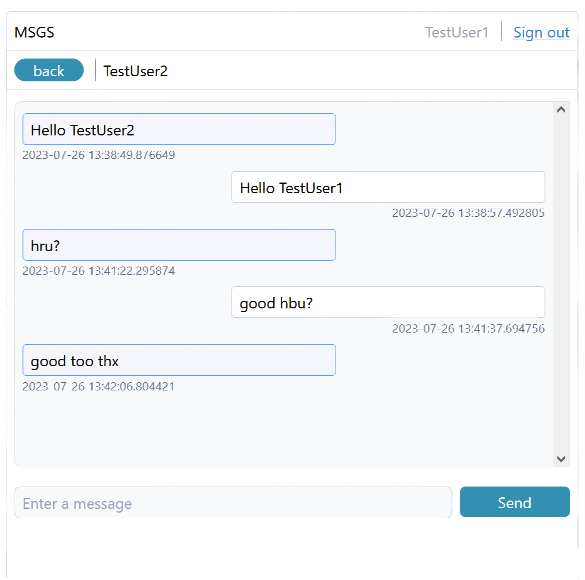
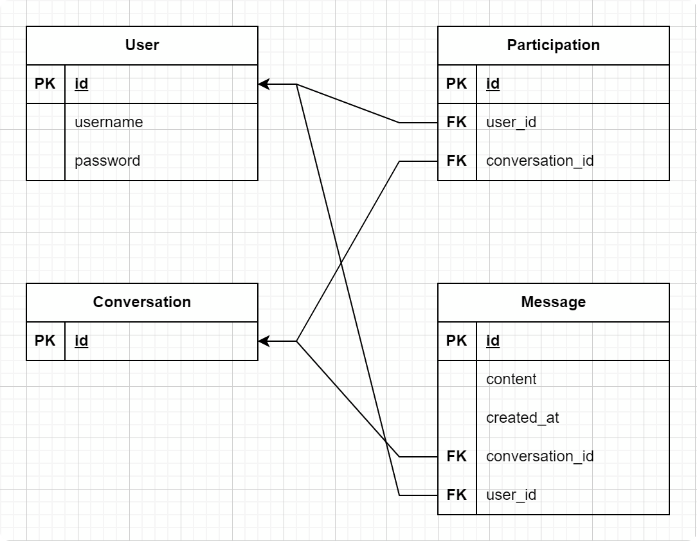

# MSGS

<div>
  
  
</div>

## Running

1\. Clone the repository.
```
git clone https://github.com/mhmh4/MSGS.git
```

2\. Install all dependencies using Poetry.

```
poetry install
```

Note: If you're not using Poetry, you can still install the dependencies by creating a virtual environment and using `requirements.txt`.

2\.5. (Optional). If you have MySQL on your machine and would like to use that instead of SQLite, do the following:
* Rename `config.ini.template` to `config.ini`
* Add your connection parameters to `config.ini`
* Go to `msgs/__init__.py` and set `DB_FLAG`'s value to 1.

3\. Run the following Poetry command.
```
poetry run python run.py
```

4\. Open a web browser to `localhost:5000` to see the application.

## License

[MIT](https://github.com/mhmh4/MSGS/blob/main/LICENSE)
