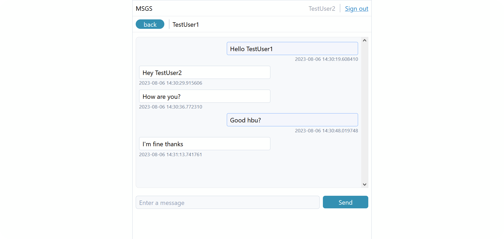

# flask-messenger

<div>
  
  
</div>

## Running

1\) Clone the repository.

```
git clone https://github.com/mhmh4/flask-messenger.git
```

2\) Install dependencies using pip.

```
pip install -r requirements.txt
```

2.5\) [Optional] If you have PostgreSQL on your machine and would like to use it instead of SQLite, do the following:
- Rename `config.ini.template` to `config.ini`.
- Add your connection parameters to `config.ini`.
- Go to `msgs/__init__.py` and set `DB_FLAG`'s value to 1.

3\) Run `run.py`.

```
python run.py
```

4\) Open a web browser to `localhost:5000` to see the application.

## License

MIT
